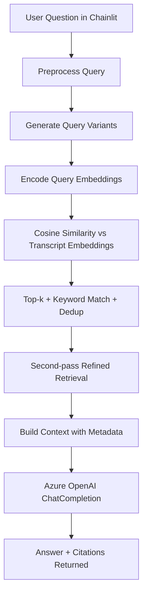

# RaceGPT Chatbot 2
## Project Presentation and PRD

Version: 1.0  
Project: `RaceGPT_Chatbot 2`  
Primary app entry: `multiapp.py`  

---

## 1. Executive Summary

RaceGPT Chatbot 2 is a transcript-aware racing assistant built to answer race strategy and communication questions from driver/crew radio logs.  
It combines semantic retrieval (embeddings + cosine similarity), query expansion, and LLM response generation with source citations.

The project focuses on making large race transcript collections searchable through natural language, so users can quickly find context that would otherwise require manual review of many files.

---

## 2. Problem Statement

Race radio transcripts are high-volume, noisy, and spread across many driver files. Manual review is slow and difficult when users need answers such as:

- What strategy calls were made during caution periods?
- Which driver reported tire or engine issues?
- What happened around a specific race phase?

### Core Problem
Convert unstructured race communication logs into an interactive assistant that can:

- Understand user questions in natural language
- Retrieve relevant transcript segments
- Generate concise answers grounded in transcript evidence
- Show where the answer came from

---

## 3. PRD (Product Requirements Document)

### 3.1 Product Vision
Build an AI copilot for race transcript intelligence that helps analysts, engineers, and racing fans quickly extract actionable insights from race communications.

### 3.2 Target Users

- Race analysts and performance engineers
- Team strategists and operations staff
- Motorsports media and content teams
- Fans exploring race events in depth

### 3.3 Goals

- Enable natural-language search over race transcripts
- Improve retrieval quality beyond keyword-only lookup
- Return explainable answers with citations
- Reduce repeated embedding compute through caching

### 3.4 Non-Goals (Current Scope)

- Real-time live telemetry integration
- Multi-modal ingest (audio/video directly)
- Full production-grade authentication and role management

### 3.5 Features Delivered

| Feature | What it does | Repo implementation |
|---|---|---|
| Transcript ingestion | Loads all race transcript files from `transcripts/` folders | `multiapp.py` |
| Structured parsing | Parses transcript entries with `[start, end, text, speaker]` format | `process_transcript()` |
| Semantic search | Embeds transcript chunks and user queries, computes cosine similarity | `SentenceTransformer` + `cosine_similarity` |
| Query expansion | Generates sample/rephrased user questions to widen retrieval | `generate_sample_questions()` |
| Two-pass retrieval refinement | Combines initial and refined similarity scores for better ranking | `handle_message()` |
| Keyword fallback recall | Adds domain-keyword matched chunks (`tire`, `caution`, etc.) | `keywords` logic |
| Response generation | Uses Azure OpenAI chat completion for final answer | `openai.ChatCompletion.create()` |
| Evidence citations | Returns race, driver, file, timestamps, speaker, and transcript snippet | Structured citations block |
| Embedding cache | Avoids recomputing embeddings for unchanged files using SHA-256 hashes | `generate_file_hash()` + cache JSON |
| Chat UI | User interaction via Chainlit | `@cl.on_chat_start`, `@cl.on_message` |

### 3.6 Functional Requirements

- FR1: User can ask free-form questions in chat
- FR2: System retrieves top relevant transcript segments semantically
- FR3: System supports enhanced recall via query variations
- FR4: System responds with answer plus source citations
- FR5: System must cache embeddings and reuse when files are unchanged

### 3.7 Non-Functional Requirements

- NFR1: Startup should avoid unnecessary re-embedding work
- NFR2: Retrieval and answer flow should handle invalid input gracefully
- NFR3: Interaction logs should support debugging and traceability
- NFR4: Pipeline should tolerate cache corruption by fallback reset

### 3.8 Success Metrics (Suggested)

- Retrieval relevance (top-k chunk quality)
- Citation usefulness (answer traceability)
- Response latency per query
- Cache hit rate across restarts
- User-perceived answer accuracy

---

## 4. Technical Architecture



### Stack

- UI: Chainlit
- Embeddings: `sentence-transformers` (`all-mpnet-base-v2`)
- Similarity: `scikit-learn` cosine similarity
- LLM: Azure OpenAI (`ChatCompletion`)
- Config: `.env` via `python-dotenv`
- Cache: JSON embedding cache in `embedding_cache/`

---

## 5. Data Coverage in This Repo

- Race folders: 2
- Transcript files: 50 total
- Distribution:
  - `Indy_500_2024_unprocessed_radios`: 29 files
  - `Long_Beach_2024_radios`: 21 files

### Transcript Format Note

Current parser expects structured list-style transcript records.  
Files in `Indy_500_2024_unprocessed_radios` follow this format directly; files in `Long_Beach_2024_radios` are plain text format and need parser adaptation for full ingestion.

---

## 6. Optimizations Implemented

| Optimization | Implementation | Benefit |
|---|---|---|
| File-level cache invalidation | SHA-256 per transcript file | Re-embed only changed files |
| Embedding persistence | JSON cache loaded at start and saved on exit | Faster startup after first run |
| Query expansion | Generate multiple semantically related query variants | Better recall for vague questions |
| Two-pass ranking | Initial + refined query scores combined | Improved relevance of final context |
| Keyword recall safety net | Domain keyword matching appended to semantic results | Catches important domain mentions |
| Deduplication | Dictionary keyed by transcript text | Cleaner context, less repetition |
| Input normalization | Lowercase + punctuation cleanup | More stable embedding behavior |

---

## 7. What We Covered in This Project

### Phase 1: Core Assistant

- Built transcript ingestion and parsing pipeline
- Implemented embedding-based retrieval
- Added chat-based interaction using Chainlit
- Integrated Azure OpenAI for answer generation

### Phase 2: Retrieval Quality and Explainability

- Added query expansion for broader semantic coverage
- Added keyword-augmented retrieval
- Added richer citations with race/driver/time/speaker references
- Improved response formatting for traceability

### Phase 3: Performance and Reliability

- Added hash-based embedding cache
- Added cache recovery for invalid JSON
- Added logging and runtime exception handling
- Added cache save on application exit

---

## 8. Risks and Next Optimization Roadmap

### Current Risks

- Mixed transcript formats reduce total searchable coverage
- In-memory linear similarity scan may become slow at larger scale
- Citation context can become verbose for long result sets

### Next Optimizations (Recommended)

- Add dual-format parser to ingest both structured and plain-text transcripts
- Replace linear scan with vector index (FAISS/Annoy) for scale
- Persist embedding matrix once to avoid repeated list-to-array conversion
- Add reranking stage for higher precision on top retrieved chunks
- Add configurable top-k/threshold controls in UI

---

## 9. Demo Narrative (For Presentation Use)

1. User asks a race strategy question in Chainlit.  
2. RaceGPT expands and embeds the question.  
3. System retrieves relevant transcript segments from drivers/races.  
4. LLM generates a grounded answer from retrieved context.  
5. User receives answer with citation metadata for verification.

---

## 10. Repository Quick Start

```bash
pip install -r requirements.txt
chainlit run multiapp.py
```

Configure `.env` with Azure OpenAI credentials before running.

