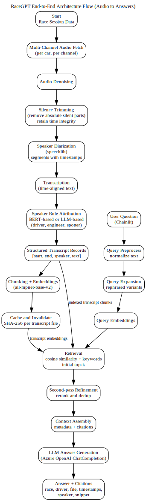

# RaceGPT: NextLap's Race Radio Intelligence Copilot

RaceGPT Chatbot turns noisy multi-channel race radio audio and transcripts into a **searchable, allignement based (citation-grounded) assistant** for race strategy and communication analysis.

It combines **audio preprocessing**, **speaker diarization**, **speaker role attribution**, and a **RAG pipeline (embeddings + retrieval + LLM)** so strategists and analysts can ask natural-language questions and get answers backed by transcript evidence.

## What I Built (Impact)

* **Enhanced competitor analysis** with tools that unify race communication data into insights, driving strategy without manual overhead.
* **Built an end-to-end AI pipeline** for race data including denoising, diarization, alignment, transcription, embeddings, and RAG, powering natural-language queries.
* **Architected blueprint solutions and PoCs** to support end-to-end AI planning, decision support, and streamlined deliverables.

---

## Problem

Race radio communications are:

* High volume and spread across many drivers and channels
* Noisy, full of interruptions, and hard to review manually
* Time-sensitive when strategy teams need answers quickly

**Goal:** Convert unstructured race communications into an assistant that can:

* Understand questions in natural language
* Retrieve the most relevant transcript segments
* Generate concise answers grounded in evidence
* Provide citations with timestamps, driver, speaker, and file context

---

## End-to-End Pipeline (Audio to Answers)

### Phase 0: Multi-Channel Audio Ingest

* Fetch race audio from **multiple channels** and retain channel metadata
* Preserve time alignment across channels for downstream accuracy

### Phase 1: Audio Preprocessing

* **Denoising**
* **Silence trimming** (remove absolute silent regions while keeping time integrity)
* Ensure **speaker timestamps remain reliable** for later transcript citations

### Phase 2: Speaker Diarization

* Run diarization using `speechlib`
  Repo: [https://github.com/NavodPeiris/speechlib](https://github.com/NavodPeiris/speechlib)
* Output: time-stamped speaker segments per channel

### Phase 3: Speaker Role Attribution

After diarization + transcript generation, map speakers to roles such as:

* `driver1`, `engineer1`, `spotter`, `engineer2`, etc.
* Approaches: 
    * **BERT-based classification** (fast, structured)
    * **LLM-based classification** (robust to messy inputs)

### Phase 4: Transcript Intelligence (RAG Assistant)

* Parse transcripts into structured records `[start, end, text, speaker]`
* Chunk and embed transcripts
* Retrieve top evidence via cosine similarity plus keyword fallback
* Generate a final answer using an LLM with **citations**

---

## Key Features Implemented (Repo Scope)

| Feature                       | What it does                                             | Where                                       |
| ----------------------------- | -------------------------------------------------------- | ------------------------------------------- |
| Transcript ingestion          | Loads transcript files from race folders                 | `multiapp.py`                               |
| Parsing to structured records | Normalizes entries into `[start, end, text, speaker]`    | `process_transcript()`                      |
| Semantic retrieval            | Embeddings + cosine similarity ranking                   | `SentenceTransformer` + `cosine_similarity` |
| Query expansion               | Generates rephrased queries to improve recall            | `generate_sample_questions()`               |
| Two-pass retrieval            | Initial retrieval + refined rerank                       | `handle_message()`                          |
| Keyword recall fallback       | Adds domain keyword matches like `caution`, `tire`, etc. | keywords logic                              |
| LLM answer generation         | Produces final grounded answer                           | `openai.ChatCompletion.create()`            |
| Evidence citations            | Returns metadata with timestamps, speaker, file          | citations block                             |
| Embedding cache               | Hash-based cache invalidation per file                   | `generate_file_hash()` + cache JSON         |
| Chat UI                       | Interactive chat experience                              | Chainlit handlers                           |

---

## Tech Stack

* **UI:** Chainlit
* **Embeddings:** `sentence-transformers` (`all-mpnet-base-v2`)
* **Similarity:** cosine similarity (scikit-learn)
* **LLM:** Azure OpenAI ChatCompletion
* **Config:** `.env` with `python-dotenv`
* **Caching:** JSON embedding cache in `embedding_cache/`

---

## Repository Snapshot

* Primary entry: `multiapp.py`
* Data directories:

  * `Indy_500_2024_unprocessed_radios/` (structured transcript format)
  * `Long_Beach_2024_radios/` (plain text format, needs parser adaptation for full ingestion)
* Cache:

  * `embedding_cache/` (file hash and embedding reuse)

---

## Example Questions This Supports

* “What strategy calls happened during caution periods?”
* “Which driver reported tire degradation and when?”
* “What happened around lap X or the final stint?”
* “Show all radio calls mentioning fuel saving or lift and coast.”

---

## Quick Start - Follow Setup-Guide.md for more concrete instructions

```bash
pip install -r requirements.txt
chainlit run multiapp.py
```

Create a `.env` with your Azure OpenAI credentials before running.

---

## System Components Diagram (Graphviz DOT)


---

## Architecture Diagram (Graphviz DOT)



---

## Roadmap (Next Up)

* Add a dual-format parser to fully ingest both structured and plain text transcript formats
* Replace linear similarity scans with a vector index (FAISS or Annoy) for scale
* Add reranking for higher precision on top retrieved chunks
* Add UI controls for top-k and similarity thresholds
* Persist embedding matrices to avoid repeated conversions at runtime
